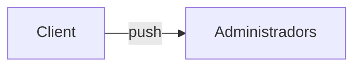

# Notificacions

## Introducció

Aquest document descriu el protocol de notificacions per a aquesta aplicació.

El servei de notificacions s'hereda de la definició [abstracta](../../../../core/notifications/README.md) que s'implementa a la carpeta del projecte `src/core/notifications/`.

<br />

# [Tipologies](#notificacions)

Les notificacions de l'aplicació són dels següents tipus:

- Notificacions de <u>seguretat</u>.

- Notificacions de <u>configuració</u>.

- Notificacions de <u>serveis</u>.

<br />
<br />

## [Notificacions de seguretat.](#notificacions)

| Descripció | Alerta | Acció |
| ---------- | ------ | ----- |
| Actualització de permisos | ALERTA_UPDATE_PERMISSIONS | refreshPermissions |
| Logout forçat | ALERTA_LOGOUT_FORZADO | logout |

<br />
<br />

## [Notificacions de configuració.](#notificacions)

| Descripció | Alerta | Acció |
| ---------- | ------ |:---- |
| Actualització dels blobs de dades | ALERTA_UPDATE_BLOBS | forceLoadBlobs |

<br />
<br />

## [Notificacions de serveis.](#notificacions)

Les notificacions de serveis responsen al cicle de vida s'un servei en la seva basant més complexa, és a dir, la <u>reserva</u> d'un servei.

Durant el cicle de vida, cada canvi d'estat genera la notificació corresponent:

| Descripció | Alerta | Estat |
| ---------- | ------ |:----:|
| [Creació del servei](#creació-del-servei) | ALERTA_NUEVO_SERVICIO, <br />ALERTA_NUEVO_SERVICIO_CON_MAS_VEHICULOS | Pendiente |
| [Modificació del servei](#modificació-del-servei) | ALERTA_SERVICIO_MODIFICADO, <br />ALERTA_SERVICIO_MODIFICADO_CON_MAS_VEHICULOS | Pendiente |
| [Confirmació del servei](#confirmació-del-servei) | ALERTA_SERVICIO_CONFIRMADO | Confirmado |
| [Enviament d'ofertes](#enviament-d'ofertes) | ALERTA_OFERTA_REALIZADA | Pendiente |
| [Acceptació](#acceptació) | ALERTA_OFERTA_ACEPTADA | Confirmado |
| [Cancel·lació pel Client](#Cancel·lació-pel-Client) | ALERTA_SERVICIO_CANCELADO | Cancelado |
| [Cancel·lació per l'Admin](#Cancel·lació-per-l'Admin) | ALERTA_SERVICIO_CANCELADO | Cancelado |
| [Assignació de conductor](#Assignació-de-conductor) | ALERTA_CONDUCTOR_ASIGNADO | Asignada |
| [Re Assignació de conductor](#Re-Assignació-de-conductor) | ALERTA_CONDUCTOR_RE_ASIGNADO | Asignada |
| [Desassignació de conductor](#Desassignació-de-conductor) | ALERTA_CONDUCTOR_DESASIGNADO | Confirmado |
| [Acceptació d'assignacions](#Acceptació-d'assignacions) | ALERTA_SERVICIO_ACEPTADO | Aceptado |
| [Rebuig d'assignacions](#Rebuig-d'assignacions) | ALERTA_SERVICIO_RECHAZADO | Confirmado |
| [En marxa cap al punt de recollida](#En-marxa-cap-al-punt-de-recollida) | ALERTA_SERVICIO_EN_CAMINO | En marcha |
| [Arribant al punt de recollida](#Arribant-al-punt-de-recollida) | ALERTA_SERVICIO_LLEGANDO | Llegando |
| [Esperant al passatger](#Esperant-al-passatger) | ALERTA_SERVICIO_ESPERANDO | Esperando |
| [Inici del servei](#Inici-del-servei) | ALERTA_SERVICIO_EN_CURSO | Iniciado |
| [Canvi de recorregut](#Canvi-de-recorregut) | ALERTA_CAMBIO_RECORRIDO | Iniciado |
| [Finalització del servei](#Finalització-del-servei) | ALERTA_SERVICIO_FINALIZADO | Realizado |
| [Servei pagat](#Servei-pagat) | ALERTA_SERVICIO_PAGADO | Realizado |
| [Error pagament](#Error-pagament) | ALERTA_ERROR_PAGO | Realizado |
| [Servei Valorat Negativament](#Servei-Valorat-Negativament) | ALERTA_SERVICIO_VALORADO_NEGATIVAMENTE | Realizado |


<br />
<br />

# [Creació del servei](#notificacions-de-serveis)

s## Emissió
```typescript
servicios.post
```
```json
{"tipo": TIPO_SERVICIO_RESERVA | TIPO_SERVICIO_SOLICITUD, "estado": SERVICIO_PENDIENTE, "idServicio": 65912, "idCliente": 3, "numVehiculos": 1, "esPrecioCerrado": 1}
```
| Destinatari | Notificació                                     | Grupal | Sileciosa | Obligatoria | Atendre | Component |
| ----------- | ----------------------------------------------- |:------:|:---------:|:-----------:|:-------:|:---------:|
| Admin       | `ALERTA_NUEVO_SERVICIO`                         | Sí     | Sí        | No          | Si      | Toast     |
| Admin       | `ALERTA_NUEVO_SERVICIO_CON_MAS_VEHICULOS`       | Sí     | Sí        | No          | Si      | Toast     |
<br />

```typescript
// ACCION_NAVIGATE_SERVICIO
navigateServicio(idServicio)
```
<br />
<br />
<br />


# [Modificació del servei](#notificacions-de-serveis)
  ```mermaid
  graph LR
    Client --push--> Administradors
    Admin --push--> Client2[Client]
    Admin --push--> Administradors2[Administradors]
  ```
## Emissió
```typescript
servicios.put
```
```json
{"tipo": TIPO_SERVICIO_RESERVA | TIPO_SERVICIO_SOLICITUD, "estado": SERVICIO_PENDIENTE, "idServicio": 65912, "idCliente": 3, "numVehiculos": 1, "esPrecioCerrado": 1}
```
| Destinatari | Notificació                                     | Grupal | Sileciosa | Obligatoria | Atendre | Component |
| ----------- | ----------------------------------------------- |:------:|:---------:|:-----------:|:-------:|:---------:|
| Admin       | `ALERTA_SERVICIO_MODIFICADO`                    | Sí     | No        | No          | Si      | Toast     |
| Admin       | `ALERTA_SERVICIO_MODIFICADO_CON_MAS_VEHICULOS`  | Sí     | No        | No          | Si      | Toast     |
<br />

```typescript
// ACCION_NAVIGATE_SERVICIO
navigateServicio(idServicio)
```
<br />
<br />
<br />


# [Confirmació del servei](#notificacions-de-serveis)
  ```mermaid
  graph LR
    Admin --push--> Client
    Admin ---> Administradors
  ```
## Emissió
```typescript
servicios.confirmar
```
```json
{"tipo": TIPO_SERVICIO_RESERVA | TIPO_SERVICIO_SOLICITUD, "estado": SERVICIO_CONFIRMADO, "idServicio": 65912, "idAdmin": 1}
```
| Destinatari | Notificació                                     | Grupal | Sileciosa | Obligatoria | Atendre | Component |
| ----------- | ----------------------------------------------- |:------:|:---------:|:-----------:|:-------:|:---------:|
| Client      | `ALERTA_SERVICIO_CONFIRMADO`                    | No     | No        | No          | No      | Toast     |
<br />

```typescript
// ALERTA_SERVICIO_CONFIRMADO
navigateServicio(idServicio)

```
<br />
<br />
<br />

# [Enviament d'ofertes](#notificacions-de-serveis)

  ```mermaid
  graph LR
    Admin --push--> Client
  ```

## Emissió

```typescript
servicios.enviarOfertas
```
```json
{"tipo": TIPO_SERVICIO_RESERVA, "estado": SERVICIO_PENDIENTE, "idServicio": 65912, "idAdmin": 1}
```
| Destinatari | Notificació                                     | Grupal | Sileciosa | Obligatoria | Atendre | Component |
| ----------- | ----------------------------------------------- |:------:|:---------:|:-----------:|:-------:|:---------:|
| Client      | `ALERTA_OFERTA_REALIZADA`                       | No     | No        | Sí          | Sí      | Alert     |

```typescript
// ALERTA_OFERTA_REALIZADA
navigateServicio(idServicio)->navigateOfertas(idServicio)
```

<br />
<br />
<br />

# [Acceptació](#notificacions-de-serveis)

  ```mermaid
  graph LR
    Client --push--> Administradors
  ```

## Emissió

```typescript
servicios.aceptarOferta
```
```json
{"tipo": TIPO_SERVICIO_RESERVA, "estado": SERVICIO_CONFIRMADO, "idServicio": 65912}
```
| Destinatari | Notificació                                     | Grupal | Sileciosa | Obligatoria | Atendre | Component |
| ----------- | ----------------------------------------------- |:------:|:---------:|:-----------:|:-------:|:---------:|
| Admin       | `ALERTA_OFERTA_ACEPTADA`                        | Si     | No        | No          | No      | Toast     |

```typescript
// ALERTA_OFERTA_ACEPTADA
navigateServicio(idServicio)
```

<br />
<br />
<br />

# [Cancel·lació pel Client](#notificacions-de-serveis)

  ```mermaid
  graph LR
    Client --push--> Administradors
    Client --push--> Conductores
  ```

## Emissió

```typescript
servicios.cancelar
```
```json
{"tipo": TIPO_SERVICIO_RESERVA | TIPO_SERVICIO_SOLICITUD, "estado": SERVICIO_CANCELADO_USUARIO, "idServicio": 65912, "idCliente": 3}
```

| Destinatari | Notificació                                     | Grupal | Sileciosa | Obligatoria | Atendre | Component |
| ----------- | ----------------------------------------------- |:------:|:---------:|:-----------:|:-------:|:---------:|
| Admin       | `ALERTA_SERVICIO_CANCELADO`                     | Si     | No        | No          | Si      | Toast     |
| Conductores | `ALERTA_SERVICIO_CANCELADO`                     | No     | No        | No          | Si      | Toast     |

```typescript
// ALERTA_SERVICIO_CANCELADO
navigateServicio(idServicio)
```

<br />
<br />
<br />

# [Cancel·lació per l'Admin](#notificacions-de-serveis)

  ```mermaid
  graph LR
    Administrador --push--> Client
    Administrador --push--> Conductores
  ```

## Emissió

```typescript
servicios.cancelar
```
```json
{"tipo": TIPO_SERVICIO_RESERVA | TIPO_SERVICIO_SOLICITUD, "estado": SERVICIO_CANCELADO_ADMIN, "idServicio": 65912, "idAdmin": 1}
```

| Destinatari | Notificació                                     | Grupal | Sileciosa | Obligatoria | Atendre | Component |
| ----------- | ----------------------------------------------- |:------:|:---------:|:-----------:|:-------:|:---------:|
| Cliente     | `ALERTA_SERVICIO_CANCELADO`                     | No     | No        | No          | Si      | Toast     |
| Conductores | `ALERTA_SERVICIO_CANCELADO`                     | No     | No        | No          | Si      | Toast     |

```typescript
// ALERTA_SERVICIO_CANCELADO
navigateServicio(idServicio)
```

<br />
<br />
<br />

# [Assignació de conductor](#notificacions-de-serveis)

  ```mermaid
  graph LR
    Administrador --push--> Conductor
  ```

## Emissió

```typescript
servicios.asignar
```
```json
{"tipo": TIPO_SERVICIO_RESERVA | TIPO_SERVICIO_SOLICITUD, "estado": SERVICIO_ASIGNADO, "idServicio": 65912, "idAdmin": 1, "idConductor": 2, "idPrestacion": 4567}
```

| Destinatari | Notificació                                     | Grupal | Sileciosa | Obligatoria | Atendre | Component |
| ----------- | ----------------------------------------------- |:------:|:---------:|:-----------:|:-------:|:---------:|
| Conductor   | `ALERTA_CONDUCTOR_ASIGNADO`                     | No     | No        | No          | Si      | Toast     |


```typescript
// ALERTA_CONDUCTOR_ASIGNADO
navigateServicio(idServicio)
```

<br />
<br />
<br />


# [Re Assignació de conductor](#notificacions-de-serveis)

  ```mermaid
  graph LR
    Administrador --push--> Conductor
    Administrador .-push.-> ConductorAnterior 
  ```

## Emissió

```typescript
servicios.asignar
```
```json
{"tipo": TIPO_SERVICIO_RESERVA | TIPO_SERVICIO_SOLICITUD, "estado": SERVICIO_ASIGNADO, "idServicio": 65912, "idAdmin": 1, "idConductor": 3, "idAnterior": 2, "idPrestacion": 4567}
```

| Destinatari | Notificació                                     | Grupal | Sileciosa | Obligatoria | Atendre | Component |
| ----------- | ----------------------------------------------- |:------:|:---------:|:-----------:|:-------:|:---------:|
| Conductor   | `ALERTA_CONDUCTOR_RE_ASIGNADO`                  | No     | No        | No          | Si      | Toast     |
| Co. Anterior| `ALERTA_CONDUCTOR_RE_ASIGNADO`                  | No     | No        | No          | Si      | Toast     |

```typescript
// ALERTA_CONDUCTOR_RE_ASIGNADO
navigateServicio(idServicio)
```

<br />
<br />
<br />

# [Desassignació de conductor](#notificacions-de-serveis)

  ```mermaid
  graph LR
    Administrador --push--> Conductor
  ```

## Emissió

```typescript
servicios.desasignar
```
```json
{"tipo": TIPO_SERVICIO_RESERVA | TIPO_SERVICIO_SOLICITUD, "estado": SERVICIO_CONFIRMADO, "idServicio": 65912, "idAdmin": 1, "idAnterior": 2, "idPrestacion": 4567}
```

| Destinatari | Notificació                                     | Grupal | Sileciosa | Obligatoria | Atendre | Component |
| ----------- | ----------------------------------------------- |:------:|:---------:|:-----------:|:-------:|:---------:|
| Conductor   | `ALERTA_CONDUCTOR_DESASIGNADO`                  | No     | No        | No          | Si      | Toast     |

```typescript
// ALERTA_CONDUCTOR_DESASIGNADO
navigateServicio(idServicio)
```

<br />
<br />
<br />

# [Acceptació d'assignacions](#notificacions-de-serveis)

  ```mermaid
  graph LR
    Conductor --push--> Administradors
  ```

## Emissió

```typescript
servicios.aceptar
```
```json
{"tipo": TIPO_SERVICIO_RESERVA | TIPO_SERVICIO_SOLICITUD, "estado": SERVICIO_ACEPTADO, "idServicio": 65912, "idConductor": 1, "idPrestacion": 4567, "idPrestacion": 4567}
```

| Destinatari | Notificació                                     | Grupal | Sileciosa | Obligatoria | Atendre | Component |
| ----------- | ----------------------------------------------- |:------:|:---------:|:-----------:|:-------:|:---------:|
| Admin       | `ALERTA_SERVICIO_ACEPTADO`                      | Si     | No        | No          | No      | Toast     |

```typescript
// ALERTA_SERVICIO_ACEPTADO
navigateServicio(idServicio)
```

<br />
<br />
<br />

# [Rebuig d'assignacions](#notificacions-de-serveis)

  ```mermaid
  graph LR
    Conductor --push--> Administradors
  ```

## Emissió

```typescript
servicios.rechazar
```
```json
{"tipo": TIPO_SERVICIO_RESERVA | TIPO_SERVICIO_SOLICITUD, "estado": SERVICIO_CONFIRMADO | SERVICIO_ASIGNADO, "idServicio": 65912, "idConductor": 1, "idPrestacion": 4567}
```

| Destinatari | Notificació                                     | Grupal | Sileciosa | Obligatoria | Atendre | Component |
| ----------- | ----------------------------------------------- |:------:|:---------:|:-----------:|:-------:|:---------:|
| Admin       | `ALERTA_SERVICIO_RECHAZADO`                     | Si     | No        | No          | Si      | Toast     |

```typescript
// ALERTA_SERVICIO_RECHAZADO
navigateServicio(idServicio)
```

<br />
<br />
<br />

# [En marxa cap al punt de recollida](#notificacions-de-serveis)

  ```mermaid
  graph LR
    Conductor --push--> Administradors
  ```

## Emissió

```typescript
servicios.encamino
```
```json
{"tipo": TIPO_SERVICIO_RESERVA | TIPO_SERVICIO_SOLICITUD, "estado": SERVICIO_EN_CAMINO, "idServicio": 65912, "idConductor": 1, "idPrestacion": 4567}
```

| Destinatari | Notificació                                     | Grupal | Sileciosa | Obligatoria | Atendre | Component |
| ----------- | ----------------------------------------------- |:------:|:---------:|:-----------:|:-------:|:---------:|
| Admin       | `ALERTA_SERVICIO_EN_CAMINO`                     | Si     | No        | No          | No      | Toast     |

```typescript
// ALERTA_SERVICIO_EN_CAMINO
navigateServicio(idServicio)
```

<br />
<br />
<br />

# [Arribant al punt de recollida](#notificacions-de-serveis)

  ```mermaid
  graph LR
    Conductor --push--> Client
    Conductor --push--> Administradors
  ```

## Emissió

```typescript
servicios.llegando
```
```json
{"tipo": TIPO_SERVICIO_RESERVA | TIPO_SERVICIO_SOLICITUD, "estado": SERVICIO_LLEGANDO, "idServicio": 65912, "idConductor": 1, "idPrestacion": 4567}
```

| Destinatari | Notificació                                     | Grupal | Sileciosa | Obligatoria | Atendre | Component |
| ----------- | ----------------------------------------------- |:------:|:---------:|:-----------:|:-------:|:---------:|
| Client      | `ALERTA_SERVICIO_LLEGANDO`                      | No     | No        | No          | Si      | Toast     |
| Admin       | `ALERTA_SERVICIO_LLEGANDO`                      | Si     | No        | No          | No      | Toast     |

```typescript
// ALERTA_SERVICIO_LLEGANDO
navigateServicio(idServicio)->navigatePretracking(idServicio)
```

<br />
<br />
<br />

# [Esperant al passatger](#notificacions-de-serveis)

  ```mermaid
  graph LR
    Conductor --push--> Client
    Conductor --push--> Administradors
  ```

## Emissió

```typescript
servicios.esperando
```
```json
{"tipo": TIPO_SERVICIO_RESERVA | TIPO_SERVICIO_SOLICITUD, "estado": SERVICIO_ESPERANDO, "idServicio": 65912, "idConductor": 1, "idPrestacion": 4567}
```

| Destinatari | Notificació                                     | Grupal | Sileciosa | Obligatoria | Atendre | Component |
| ----------- | ----------------------------------------------- |:------:|:---------:|:-----------:|:-------:|:---------:|
| Client      | `ALERTA_SERVICIO_ESPERANDO`                     | No     | No        | Si          | No      | Toast     |
| Admin       | `ALERTA_SERVICIO_ESPERANDO`                     | Si     | No        | No          | No      | Toast     |

```typescript
// ALERTA_SERVICIO_ESPERANDO
navigateServicio(idServicio)->navigatePretracking(idServicio)
```

<br />
<br />
<br />

# [Inici del servei](#notificacions-de-serveis)

  ```mermaid
  graph LR
    Conductor --push--> Client
    Conductor --push--> Administradors
  ```

## Emissió

```typescript
servicios.iniciar
```
```json
{"tipo": TIPO_SERVICIO_RESERVA | TIPO_SERVICIO_SOLICITUD, "estado": SERVICIO_EN_CURSO, "idServicio": 65912, "idConductor": 1, "idPrestacion": 4567 }
```

| Destinatari | Notificació                                     | Grupal | Sileciosa | Obligatoria | Atendre | Component |
| ----------- | ----------------------------------------------- |:------:|:---------:|:-----------:|:-------:|:---------:|
| Client      | `ALERTA_SERVICIO_INICIADO`                      | No     | No        | No          | Si      | Toast     |
| Admin       | `ALERTA_SERVICIO_INICIADO`                      | Si     | No        | No          | No      | Toast     |

```typescript
// ALERTA_SERVICIO_EN_CURSO
navigateServicio(idServicio)
```

<br />
<br />
<br />

# [Canvi de recorregut](#notificacions-de-serveis)

  ```mermaid
  graph LR
    Conductor --push--> Administradors
  ```

## Emissió

```typescript
servicios.cambioRecorrido
```
```json
{"tipo": TIPO_SERVICIO_RESERVA | TIPO_SERVICIO_SOLICITUD, "estado": SERVICIO_EN_CURSO, "idServicio": 65912, "idConductor": 1, "idPrestacion": 4567}
```

| Destinatari | Notificació                                     | Grupal | Sileciosa | Obligatoria | Atendre | Component |
| ----------- | ----------------------------------------------- |:------:|:---------:|:-----------:|:-------:|:---------:|
| Client      | `ALERTA_SERVICIO_CAMBIO_RECORRIDO`              | No     | No        | No          | Si      | Toast     |
| Admin       | `ALERTA_SERVICIO_CAMBIO_RECORRIDO`              | Si     | No        | No          | Si      | Toast     |

```typescript
// ALERTA_SERVICIO_CAMBIO_RECORRIDO
navigateServicio(idServicio)
```

<br />
<br />
<br />

# [Finalització del servei](#notificacions-de-serveis)

  ```mermaid
  graph LR
    Conductor --push--> Client
    Conductor --push--> Administradors
  ```

## Emissió

```typescript
servicios.finalizar
```
```json
{"tipo": TIPO_SERVICIO_RESERVA | TIPO_SERVICIO_SOLICITUD, "estado": SERVICIO_REALIZADO, "idServicio": 65912, "idConductor": 1, "idPrestacion": 4567}
```

| Destinatari | Notificació                                     | Grupal | Sileciosa | Obligatoria | Atendre | Component |
| ----------- | ----------------------------------------------- |:------:|:---------:|:-----------:|:-------:|:---------:|
| Admin       | `ALERTA_SERVICIO_FINALIZADO`                    | Si     | No        | No          | No      | Toast     |
| Client      | `ALERTA_SERVICIO_FINALIZADO` ( transferencia )  | No     | No        | No          | No      | Toast     |
| Client      | `ALERTA_PUEDE_REALIZAR_PAGO` ( por pasarela )   | No     | No        | Sí          | Sí      | Toast     |

```typescript
// ALERTA_SERVICIO_FINALIZADO
navigateServicio(idServicio)
// ALERTA_PUEDE_REALIZAR_PAGO pel Client, encara que tingui les push desactivades l'app mostre la pantalla de pagament.
navigateServicio(idServicio)->pagarServicio(idServicio)
```

<br />
<br />
<br />

# [Servei pagat](#notificacions-de-serveis)

## Emissió

```typescript
payments.validation.redsys, payments.validation.stripe, payments.validation.paypal
```
  ```mermaid
  graph LR
    Entidad --"pago confirmado"--> Server
    Server --push--> Client
    Server --push--> Conductor
    Server --push--> Administradors
  ```


## Emissió

```typescript
servicios.payment.efectivo, servicios.payment.tpv
```

  ```mermaid
  graph LR
    Conductor --push--> Client
    Conductor --push--> Administradors
  ```


```json
{"tipo": TIPO_SERVICIO_RESERVA | TIPO_SERVICIO_SOLICITUD, "estado": SERVICIO_REALIZADO, "idServicio": 65912}
```

| Destinatari | Notificació                                     | Grupal | Sileciosa | Obligatoria | Atendre | Component |
| ----------- | ----------------------------------------------- |:------:|:---------:|:-----------:|:-------:|:---------:|
| Client      | `ALERTA_SERVICIO_PAGADO` ( por pasarela )       | No     | Sí        | No          | No      | Toast     |
| Client      | `ALERTA_SERVICIO_PAGADO` ( al conductor )       | No     | No        | Sí          | No      | Toast     |
| Conductor   | `ALERTA_SERVICIO_PAGADO`                        | No     | No        | Sí          | No      | Toast     |
| Admin       | `ALERTA_SERVICIO_PAGADO`                        | Si     | No        | No          | No      | Toast     |

```typescript
// ALERTA_SERVICIO_PAGADO Emisió Server Al Client
finishPago()
// ALERTA_SERVICIO_PAGADO Emisió Conducotr Al Client
navigateServicio(idServicio)
// ALERTA_SERVICIO_PAGADO 
navigateServicio(idServicio)
```

<br />
<br />
<br />

# [Error pagament](#notificacions-de-serveis)

  ```mermaid
  graph LR
    Entidad --"error pago"--> Server
    Server --push--> Client
    Server --push--> Conductor
    Server --push--> Administradors
  ```

## Emissió

```typescript
payments.validation.redsys, payments.validation.stripe, payments.validation.paypal 
```
```json
{"tipo": TIPO_SERVICIO_RESERVA | TIPO_SERVICIO_SOLICITUD, "estado": SERVICIO_REALIZADO, "idServicio": 65912}
```

| Destinatari | Notificació                                     | Grupal | Sileciosa | Obligatoria | Atendre | Component |
| ----------- | ----------------------------------------------- |:------:|:---------:|:-----------:|:-------:|:---------:|
| Client      | `ALERTA_ERROR_PAGO`                             | No     | Sí        | No          | No      | Toast     |
| Conductor   | `ALERTA_ERROR_PAGO`                             | No     | No        | Sí          | No      | Toast     |
| Admin       | `ALERTA_ERROR_PAGO`                             | Si     | No        | No          | No      | Toast     |

```typescript
// ALERTA_ERROR_PAGO Client
errorPago()
// ALERTA_ERROR_PAGO 
navigateServicio(idServicio)
```

<br />
<br />
<br />

# [Servei Valorat Negativament](#notificacions-de-serveis)

  ```mermaid
  graph LR
    Cliente --push--> Administradors
  ```

## Emissió

```typescript
servicios.valorar
```
```json
{"tipo": TIPO_SERVICIO_RESERVA | TIPO_SERVICIO_SOLICITUD, "estado": SERVICIO_REALIZADO, "idServicio": 65912}
```

| Destinatari | Notificació                                     | Grupal | Sileciosa | Obligatoria | Atendre | Component |
| ----------- | ----------------------------------------------- |:------:|:---------:|:-----------:|:-------:|:---------:|
| Admin       | `ALERTA_SERVICIO_VALORADO_NEGATIVAMENTE`        | Si     | No        | No          | Sí      | Toast     |

```typescript
// ALERTA_SERVICIO_VALORADO_NEGATIVAMENTE 
navigateServicio(idServicio)
```

<br />
<br />
<br />