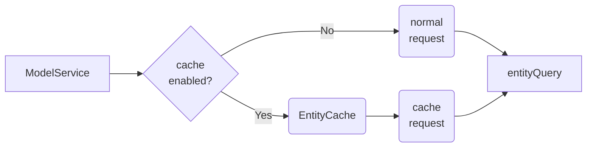
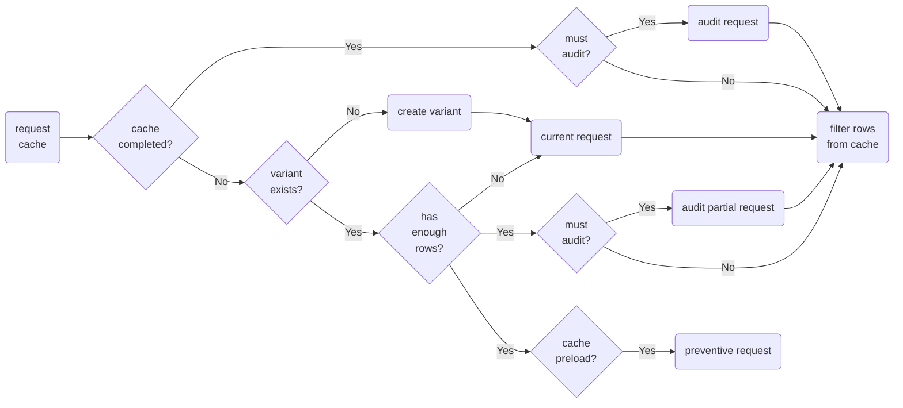

<br />

# _Cache_ de consultes

[Variants d'una consulta](#variants-d'una-consulta) | [_Cache_ completada](#_cache_-completada) | [Sol·licituds d'auditoria](#sol·licituds-d'auditoria) | [Funcionalitat](#funcionalitat)

La classe `EntityCache` administra les diferents variants d'una consulta per tal d'estalviar consultes al _backend_.

<br />



<br /> 

## [Variants d'una consulta](#cache-de-consultes)

Entenem per variants d'una consulta totes aquelles sol·licituds que comparteixen:
  - Camps sol·licitats ( _`select`_ )
  - Entitat principal ( _`from`_ )
  - Entitats relacionades ( _`join`_ )

... i difereixen en:
 - Clàusules de filtrat ( _`where`_ )
 - Ordenació de les files ( _`order by`_ )

Es poden agrupar en funció de si tenen o no clàusules de filtrat com a:
  - Sol·licituds **absolutes**: s'obtindran totes les files si es consumeixen totes les pàgines.
  - Sol·licituds **parcials** o sub-consultes: s'obtindran un sub-conjunt de files de l'entitat.

<br /> 

## [_Cache_ completada](#cache-de-consultes)

Quan una variant absoluta ja ha carregat totes les seves pàgines es fa innecessari continuar sol·licitant-ne les files. A partir d'aquest moment:

- S'eliminaran de la _cache_ tota la resta de variants.

- Totes les sol·licituds obtindran els seus resultats filtran al _frontend_ les files de la variant completada.

- Les úniques sol·licituds que es faran a _backend_ seran sol·licituds d'auditoria.

<br /> 

## [Sol·licituds d'auditoria](#cache-de-consultes)

Una sol·licitud d'auditoria és aquella que demana només per les files que han estat modificades des de la darrera consulta realitzada. Per això cal:

- Disposar dels camps d'auditoria de l'entitat a la base de dades: `created`, `updated`, `deleted`.

- Mantenir una data de la darrera sol·licitud d'auditoria per crear les condicions de filtrat.

  ```typescript
  // Establim l'hora de la darrera sol·licitud d'auditoria.
  const lastAuditTime = '20202-12-20 09:23';
  const auditSearch = { OR: [
    ['updated', '>', lastAuditTime],
    ['deleted', '>', lastAuditTime],
  ]}
  ```

- No paginar els resultats per tal d'assegurar que se n'obtenen tots els canvis.

- Substituir les files que s'han obtingut per aquelles corresponents a la _cache_ i eliminar-ne les eliminades.

<br />

## [Funcionalitat](#cache-de-consultes)

<br /> 

```typescript
const cache = {
  auditFields: { created, updated, deleted },
  preload: false,
}
```

<br />



<br />
