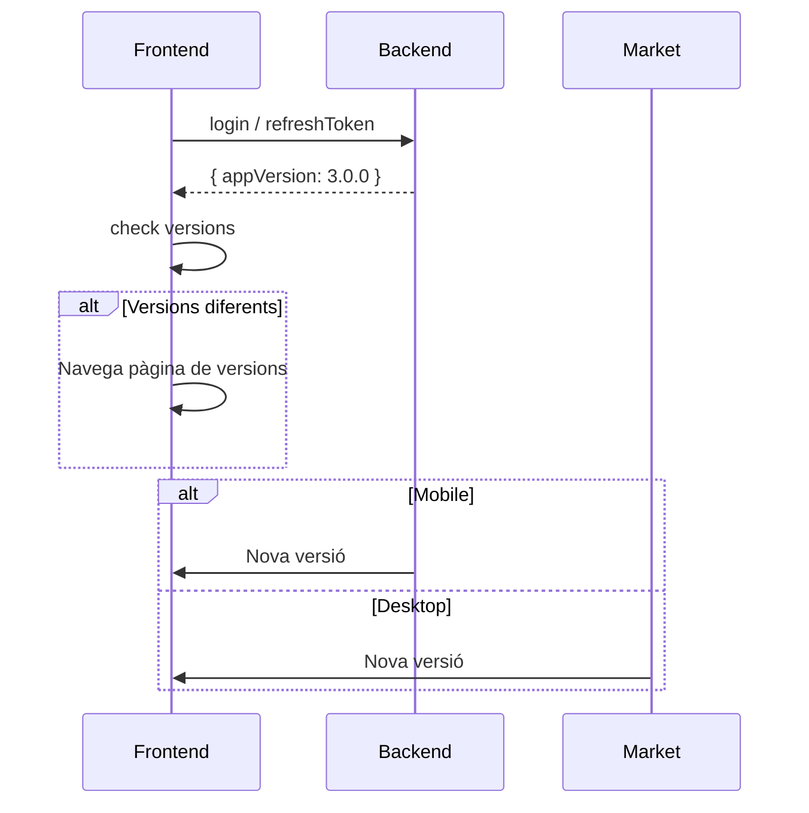
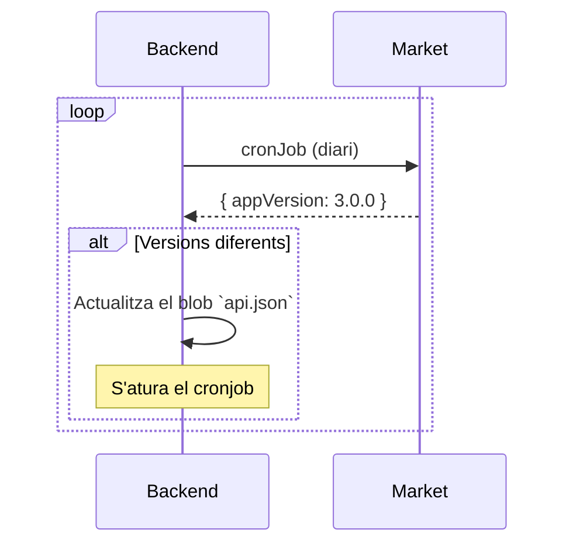

# Control de versions

El mòdul de control de versions comprova que els usuaris tinguin l'app a la última versió disponible.

Les versions de l'aplicació es tracten de manera diferent en funció de la plataforma:
- **Desktop**: un cop fet el release, els executables es pugen al servidor i s'estableix la nova versió al blob de l'aplicació.
- **Mobile**: quan es fa el release, es pugen els arxius a les plataformes corresponents `Google Play` i `Apple Store` on s'haurà d'esperar un temps fins a la seva aprovació. Per aquest motiu, les versions no s'incrementen en l'arxiu blob inmediatament. Aquesta tasca correspon a un _cronJob_ que consulta periòdicament els markets.

`api.json`
```json
{
  "versions": {
    "mac": {
      "number": "3.0.0",
      "url": "https://taxi.metacodi.com/pre/downloads/ExcelTaxi-3.0.0.pkg",
      "forced": true
    },
    "windows": {
      "number": "3.0.0",
      "url": "https://taxi.metacodi.com/pre/downloads/ExcelTaxi Setup 3.0.0.exe",
      "forced": true
    },

    "ios": {
      "number": "2.9.0",
      "forced": true
    },
    "android": {
      "number": "2.9.0",
      "forced": true
    }
  }
}
```

> La propietat `forced` indica si l'aplicació ha de ser descarregada obligatòriament o no. Per exemple quan s'ha detectat un error i es vol paliar.

<br/>

## Funcionament

- S'aprofiten les crides a `login` i `refreshToken` per a enviar l'última versió disponible a l'aplicació de l'usuari (frontend).
- Un cop rebuda la nova versió, el servei `VersionControlService` inicia la comprovació `check` de versions comparant l'obtinguda durant la crida amb la estorada localment al dispositiu.
- Si les versions són diferents, llavors el servei navega cap al component `VersionControlPage` des d'on l'usuari pot triar com descarregar la nova versió disponible.



<br/>

### **CronJob**

Quan es faci el release de les noves versions als markets, s'arrancarà un cronjob que consultarà periòdicament la versió publicada.
Quan detecti que la nova versió s'ha acceptat, s'encarregarà d'actualitzar el blob de les versions i s'aturarà fins a la nova publicació.



<br/>

## Backend
## `api/entities/modules/versionControl`

`api.json`
```json
{
  "checkAppVersion": {
    "actions": "GET",
    "access": "public"
  }
}
```

## Frontend
## `src/modules/version-control`

`version-control.module.ts`
```typescript
const routes: Routes = [
  { path: 'version-control', component: VersionControlPage },
];

@NgModule({
  declarations: [
    VersionControlPage,
  ],
})
export class VersionControlModule { }
```
